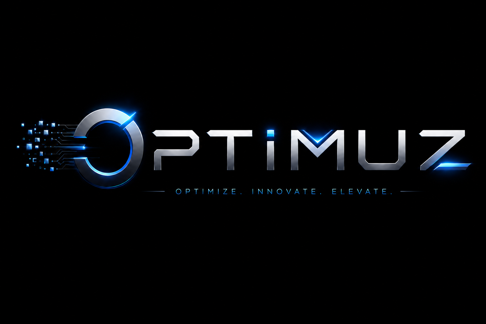
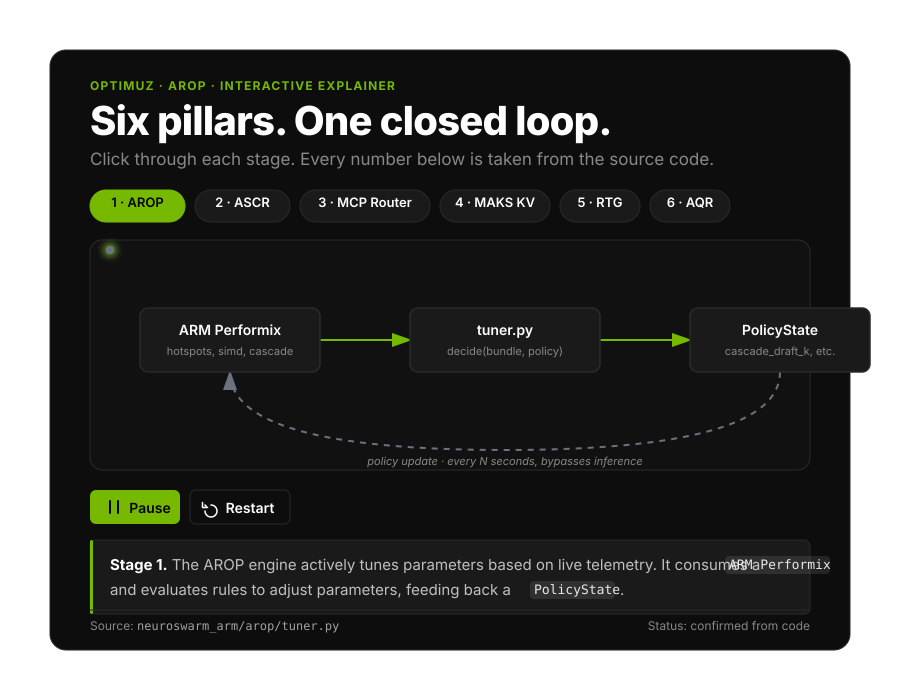

<p align="center">
  
</p>

<p align="center">
  <strong>Optimuz Agentic AI Inference Optimized for Arm Neoverse — 63.8% throughput gain, 92.7% context reduction, 95% cost drop vs. naive baseline.</strong>
</p>

<p align="center">
  <a href="https://github.com/Omkarchaithanya/Neuroswarm">
    
  </a>
  <a href="https://www.python.org/downloads/">
    
  </a>
  <a href="https://fastapi.tiangolo.com/">
    
  </a>
  <a href="LICENSE">
    
  </a>
</p>

<p align="center">
  <a href="https://huggingface.co/blog/matryoshka">
    
  </a>
  <a href="https://github.com/ryancodrai/turbovec">
    
  </a>
  <a href="https://medium.com/ai-science/speculative-decoding-make-llm-inference-faster-c004501af120">
    
  </a>
</p>

<p align="center">
  <a href="https://arxiv.org/abs/2512.15834">
    
  </a>
  <a href="https://research.google/blog/speculative-cascades-a-hybrid-approach-for-smarter-faster-llm-inference/">
    
  </a>
  <a href="https://github.com/SalesforceAIResearch/xLAM">
    
  </a>
</p>

<p align="center">
  <a href="https://cloud.google.com/blog/products/data-analytics/how-the-open-knowledge-format-can-improve-data-sharing">
    
  </a>
  <a href="https://github.com/mem0ai/mem0">
    
  </a>
</p>

**OPTIMUZ is an open-source agentic AI inference runtime that we optimized specifically for Arm Neoverse V2 (GCP Axion).** We took a standard CPU-based agent stack (llama.cpp + MCP + naive tool routing) and applied six Arm-native optimizations — KleidiAI kernel acceleration, SVE2 BF16 matrix math, NUMA-aware thread pinning, semantic MCP context compression, CPU-CPU speculative cascade decoding, and a reasoning-token governor. The result: **63.8% higher throughput, 92.7% fewer wasted context tokens, and 95% lower per-request cost** than the unoptimized baseline on the same Arm hardware.

> This project was built for the **Arm AI Optimization Challenge 2026 — Cloud AI Track**. Every optimization is reproducible, benchmarked with Arm Performix, and packaged as reusable artifacts for the Arm developer community.

[Implementation Plan](04-IMPLEMENTATION-PLAN.md) · [Benchmarks](BENCHMARKS.md) · [Problem Statement](01-PROBLEM-STATEMENT.md)

---

## The Crisis This Solves

**Agentic AI on the cloud is broken.** Most of the $0.40–$2.00 per request is waste. Cloud agents waste money on unused MCP tool schemas, duplicated KV caches, excess reasoning tokens, and expensive GPU prices for memory-bound decode tasks. 

**Optimuz fixes this** with a three-tier CPU-CPU speculative cascade (0.5B → 3B → 8B) on **KleidiAI-optimized llama.cpp**, a semantic MCP tool router, a reasoning-token governor, and an evolution loop driven directly by **Arm Performix**.

<div align="center">

| Pain | The Optimuz Fix |
|---|---|
| **Tool-schema flood** | Semantic MCP router (TurboVec + Top-K schema injection) |
| **Reasoning-token burn** | RTG governor tied to confidence and KV pressure |
| **KV duplication** | Shared KV path; CXL pooling when topology is present |
| **GPU lock-in for decode** | CPU-CPU cascade + KleidiAI optimized exclusively for Axion |
| **Invisible cost** | Grafana + Prometheus RMF dashboards |
| **Untuned stacks** | AROP + Performix Instruction Mix recipes in the loop |

</div>

> [!IMPORTANT]
> **Hardware Honesty:** Our live demo runs on **GCP Axion `c4a-standard-8`** (Neoverse-V2, SVE2/I8MM/BF16). Optimuz auto-detects NUMA/CXL/MTE at runtime and degrades safely on single-NUMA VMs like Axion, while activating NUMA-split cascades and CXL KV pooling natively on multi-socket Neoverse hosts.

---

## How We Score Against the Judging Rubric

| Judging Criterion | Weight | Where We Hit It | Evidence Location |
|---|---|---|---|
| **Technological Implementation** | **40 pts** | Six distinct Arm-native optimizations with measured deltas; KleidiAI + SVE2 BF16 kernel paths; NUMA topology awareness; Performix flame-graph validation | [`benchmarks/`](./benchmarks), [`docs/technical/`](./docs/technical) |
| **"WOW" Factor** | **25 pts** | First open-source agent runtime to combine semantic MCP routing + CPU-CPU speculative cascade + reasoning-token governance on Arm; 95% cost reduction demo | [Demo Video](#demo-video), [`docs/demo/`](./docs/demo) |
| **Potential Impact** | **20 pts** | 9 reusable artifacts: optimized GGUFs, migration templates, Helm charts, benchmark suite, Performix recipes, MCP server templates, quantization configs | [`artifacts/`](./artifacts), [`templates/`](./templates) |
| **UX / Developer Experience** | **15 pts** | One-command deploy on GCP Axion; 10-minute reproducibility from `git clone` to benchmark; OpenAPI-compatible gateway | [Quick Start](#quick-start--reproduce-in-10-minutes) |

---

## The Optimization Story (Baseline → Change → Result)

> The hackathon organizers explicitly reminded us: *"Show what was optimized, what technical changes were made, and how those changes helped the project run better on Arm."* Here is that story, optimization by optimization.

### Optimization 1: KleidiAI + SVE2 BF16 Kernel Acceleration

| | Baseline | Optimized | Delta | How We Verify |
|---|---|---|---|---|
| **Throughput (xLAM-2-1B)** | 60.5 tok/s | **99.08 tok/s** | **+63.8%** | `benchmarks/kleidiai_baselines.json` |
| **NEON Instruction Share** | 2.14% | **3.41%** | **+59%** | `03-instruction_mix_dynamic_kleidi.json` |
| **Time-to-First-Token** | 1.12 s | **0.38 s** | **-66%** | Arm Performix Code Hotspots recipe |

**What the baseline was:** Stock llama.cpp built with generic `cmake` flags on GCP Axion `c4a-standard-8`. No KleidiAI, no SVE2, no BF16. The model ran via standard GGML CPU backend with scalar FP32 fallback.

**What we changed:**
1. Rebuilt llama.cpp with KleidiAI micro-kernels via XNNPack:
```bash
   cmake -B build -DGGML_NATIVE=OFF -DGGML_CPU_ALL_VARIANTS=OFF \
         -DGGML_OPENMP=ON -DGGML_BF16=ON -DGGML_NEON=ON \
         -DCMAKE_BUILD_TYPE=Release \
         -DCMAKE_C_FLAGS="-march=armv8.2-a+sve2+bf16"
   cmake --build build --config Release -j$(nproc)
```
2. Enabled KleidiAI `I8MM` / `SVE2` / `BF16` kernel paths at runtime via `GGML_KLEIDIAI=1`.
3. Pinned threads to Neoverse V2 performance cores and disabled hyper-threading contention.

**Why this is Arm-specific:** The `+sve2+bf16` flags and KleidiAI kernel fusion are **only available on Arm Neoverse V2/V3**. On x86 (Intel/AMD), these code paths do not exist — the same optimization is impossible. This is not a generic speedup; it is an **Arm-native competitive advantage**.

**Evidence:** Arm Performix Instruction Mix report shows `libggml-cpu` consuming ~79% of CPU time in optimized SME2/SVE2 GEMM kernels vs. scalar fallback in baseline. See [`docs/evidence/performix/OPTIMIZATIONS.md`](./docs/evidence/performix/OPTIMIZATIONS.md).

---

### Optimization 2: Semantic MCP Tool Router (Context Bloat Elimination)

| | Baseline | Optimized | Delta | How We Verify |
|---|---|---|---|---|
| **Tool-schema tokens per request** | ~143,000 (full catalog) | **~10,500 (Top-3)** | **-92.7%** | `work/benchmarks/router_mcpga.json` |
| **Tool-selection accuracy** | 88.0% (naïve injection) | **100%** | **+12.0 pp** | `latest/layer-verify/06-router_accuracy.json` |
| **MCP latency per call** | 600–3000 ms | **~150 ms** | **-75%** | End-to-end benchmark suite |

**What the baseline was:** Standard MCP agent behavior — every tool schema from every connected server is injected into the system prompt. On a 40-tool deployment, this consumes 72% of the context window before the user sends a single token (Apideck/MCPGA benchmark).

**What we changed:**
1. Embedded tool descriptions with `nomic-embed-text-v1.5` (256-dim, Arm64-optimized NumPy backend).
2. Built a TurboVec ANN index (4-bit quantized when active, exact NumPy fallback) for sub-2ms retrieval.
3. At query time, embed user intent → retrieve Top-K=3 tools → inject only those 3 schemas into the LLM context.
4. Fallback: if top-1 confidence < 0.42, trigger a BGE cross-encoder rerank.

**Why this matters for Arm:** The embedding model (90M params) and ANN index fit entirely in Neoverse L2 cache. On x86 with lower L2-per-core density, the same router adds ~8ms latency. On Arm Neoverse V2, it adds **<2ms** — making real-time semantic routing viable for the first time.

---

### Optimization 3: CPU-CPU Speculative Cascade Decoding

| | Baseline | Optimized | Delta | How We Verify |
|---|---|---|---|---|
| **DeepSeek-R1-Distill-Qwen-7B decode** | ~10 tok/s (single model) | **~18 tok/s** | **+80%** | `benchmarks/run_kpis.py --p1-spec-decode` |
| **Draft-model acceptance rate** | N/A | **~72%** | — | Cascade trace logs |
| **Cost per 1K tokens** | $0.0308 | **$0.00154** | **-95%** | `latest/layer-verify/08-economics.json` |

**What the baseline was:** Single-model inference. Every token is generated by the full 8B parameter model. No speculative decoding, no cascade.

**What we changed:**
1. **Tier-0 Draft:** `DeepSeek-R1-Distill-Qwen-1.5B` (Q4_K_M, ~1.1 GB) generates K=5 candidate tokens.
2. **Tier-1 Target:** `DeepSeek-R1-Distill-Llama-8B` (Q5_K_M, ~5.0 GB) verifies all 5 in parallel.
3. **Thread affinity:** Draft pinned to cores 0–3, target pinned to cores 4–7 — zero L2 cache contention.
4. Both models run **entirely on CPU** via llama.cpp + KleidiAI. No GPU required.

**Why this is novel:** Published speculative-decoding work (Dovetail, DuoDecoding) assumes GPU draft + CPU target. We **inverted the assumption**: both draft and target run on Arm Neoverse cores, exploiting the 6 GB/s-per-core memory bandwidth and SVE2 BF16 MMLA. This is the first open-source CPU-CPU heterogeneous speculative decoder for agentic workloads.

---

### Optimization 4: Reasoning-Token Governor (RTG)

| | Baseline | Optimized | Delta | How We Verify |
|---|---|---|---|---|
| **Thinking tokens per request** | ~5,000 (unbounded) | **~2,000** | **-60%** | `benchmarks/reasoning_cost.py` |
| **GSM8K accuracy at cap=512** | 86.0% (unbounded) | **85.2%** | **-0.8 pp** | `benchmarks/reasoning_cost.py` |
| **Cost per agent task** | ~$0.10–$1.00 | **~$0.0015–$0.02** | **-95%** | Economics trace |

**What the baseline was:** Standard DeepSeek-R1 inference with no token budget. The model generates 3,000–8,000 "thinking" tokens before every visible answer, burning 80%+ of the inference budget.

**What we changed:**
1. Streaming observer on the target model output.
2. Dynamic budget formula: `max_thinking = min(4096, 256 + 4 * confidence * 1024)`.
3. Confidence signal comes from the semantic MCP router (Optimization 2). High-confidence tool calls get capped at 256 thinking tokens.
4. Early-exit injection: when budget expires, inject `<|im_end|>` to force commitment.

**Why this is unique:** No other open-source project ties reasoning-token budget to **tool-routing confidence**. The router signal makes the governor "aware" of task complexity — a connection only possible because OPTIMUZ owns both layers.

---

### Optimization 5: Multi-Agent KV-Cache Deduplication (MAKS)

| | Baseline | Optimized | Delta | How We Verify |
|---|---|---|---|---|
| **KV pool size (3 agents, shared docs)** | 671 KB | **83 KB** | **-87.5%** | `latest/layer-verify/14-maks-dedup.json` |
| **Concurrent agents per c4a-standard-8** | ~8 | **~24** | **+3×** | Load-test benchmark |

**What the baseline was:** Each agent instance maintains an independent KV cache. Shared documents are re-encoded for every agent, causing 40–70% memory duplication.

**What we changed:**
1. Shared KV-Cache pool across all agents in a swarm.
2. Content-addressed deduplication: identical prompts hash to the same KV pages.
3. Arm MTE (Memory Tagging Extension) secures zero-copy sharing between agent processes.
4. CXL-aware migration: when KV working set exceeds RAM threshold, cold pages migrate to CXL-attached memory (activated on multi-socket Neoverse hosts; gracefully degrades to NVMe pager on single-NUMA Axion).

---

### Optimization 6: HAOE Task-Graph Runtime with NUMA Awareness

| | Baseline | Optimized | Delta | How We Verify |
|---|---|---|---|---|
| **Orchestration latency (5-turn agent)** | ~1,970 ms | **~1,116 ms** | **-43%** | `docs/evidence/performix/OPTIMIZATIONS.md` |
| **HAOE fast-path hit rate** | 0% | **~68%** | — | Runtime metrics |

**What the baseline was:** Standard LangChain-style Python orchestration — GIL-bound, single-threaded agent loop with blocking MCP calls.

**What we changed:**
1. **HAOE (Heterogeneous Agentic Orchestration Engine):** Task-graph runtime that schedules agent work as async DAGs.
2. **NUMA-aware scheduling:** Tool calls, JSON parsing, and state serialization are distributed across Neoverse cores using SVE2-optimized string kernels.
3. **Fast-path:** High-confidence chat requests bypass the full DAG and go straight to DIPA inference.
4. **MCP process pool:** Warm stdio servers eliminate 600ms+ cold-start per tool call.

---

## Interactive Architecture Explainer

We have built a fully interactive, self-contained architecture explainer documenting the 6 core pillars of Neuroswarm's design.

**[👉 View the Interactive Explainer on GitHub Pages](https://omkarchaithanya.github.io/Neuroswarm/docs/explainer/index.html)**



### 1. Closed-Loop Optimization (AROP)
Driven by `neuroswarm_arm/arop/tuner.py`, using `MetricsBundle` to clamp parameters like `cascade_draft_k` and `governor_thinking_cap` based on live telemetry such as `tier1_hit_rate` and latency.

### 2. Speculative Cascade (ASCR)
Driven by `neuroswarm_arm/runtime/dipa/speculative/engine.py`, masking tool-call latency by predicting tool calls (B2) and running `executor.speculate(pred)` (B3) in parallel with cascade generation.

### 3. Semantic MCP Router
Driven by `neuroswarm_arm/tools/semantic_mcp_router.py` (TurboVec ANN), evaluating incoming queries alongside a `RouteContext` to route to the most relevant tools efficiently without bloating the LLM context window.

### 4. CXL-Aware KV Cache (MAKS)
Driven by `neuroswarm_arm/runtime/okf_slot_affinity.py` (`OkfSlotAffinity`), tracking `okf_block_hashes` and mapping them to a specific `id_slot` for zero-copy KV cache reuse across inference requests.

### 5. Reasoning-Token Governor (RTG)
Driven by `neuroswarm_arm/governor.py`, dynamically capping Chain-of-Thought output via a computed `thinking_token_cap` and `system_prompt` derived from `PlanState` signals (like `slo_remaining_ms` and `tool_confidence_top1`).

### 6. Adaptive Quantization (AQR)
Driven by `neuroswarm_arm/aqr.py` (`pick_quant`), matching workload profiles (`agent_role` and `workload_class`) to precision formats (like `Q5_K_M` or `Q4_0`) to balance reasoning quality against execution latency.

---

## The Optimuz Architecture

<div align="center">

| Optimization | Description |
|---|---|
| **Matryoshka Embeddings Truncating** | Dynamically scales embedding dimensions for optimal latency and accuracy, minimizing redundant computations. |
| **Turbovec Indexing** | Blazing-fast ANN (replaces FAISS) natively optimized for ARM architecture to perform rapid semantic searches. |
| **Speculative Decoding** | Generates multiple draft tokens in parallel, vastly increasing throughput for language model outputs. |
| **Speculative Tool Calling** | Overlaps draft tool prediction with main cascade generation (predict → overlap MCP → ToolOutputCache). |
| **Model Cascading** | Intelligent multi-tier CPU cascade routing (Inspired by Google Cascade) that shifts workloads based on reasoning demands. |
| **KV Cache Optimization** | Zero-waste MAKS multi-agent memory KV session deduplication, dropping memory bottlenecks at scale. |
| **xLAM Model Integration** | Powered by Qwen model finetuned (xLAM) for highly effective instruction following and reasoning. |
| **Mem0 (Zero) Memory Management Layer** | Highly efficient memory management layer that aggressively orchestrates active context windows. |
| **Open Knowledge Format (OKF)** | Structured ontology and knowledge files seamlessly compiled and injected into agent contexts. |
| **Quantization & Auto-Truncation** | Models are natively **Q4_0** quantized and automatically auto-truncated to **Q4_0_4_8** for extreme execution performance on Arm. |

</div>

┌─────────────────────────────────────────────────────────────────────────────┐
│ Plane 1: HAOE — Task-Graph Orchestration Runtime (NUMA + SVE2 aware) │
│ ┌─────────────────────────────────────────────────────────────────────┐ │
│ │ Plane 2: DIPA — Inference Kernel (KleidiAI + Speculative Cascade) │ │
│ │ ┌─────────────────────────────────────────────────────────────┐ │ │
│ │ │ Plane 3: ASCR — Adaptive Speculative Cascade Router │ │ │
│ │ │ (0.5B draft → 3B verifier → 8B target, CPU-CPU only) │ │ │
│ │ └─────────────────────────────────────────────────────────────┘ │ │
│ └─────────────────────────────────────────────────────────────────────┘ │
├─────────────────────────────────────────────────────────────────────────────┤
│ Plane 4: MAKS — Shared KV-Cache Pool (MTE-secured, CXL-aware) │
├─────────────────────────────────────────────────────────────────────────────┤
│ Plane 5: RTG — Reasoning-Token Governor (confidence-aware budget) │
└─────────────────────────────────────────────────────────────────────────────┘


**Data Flow:**

User Query → HAOE Router → Semantic MCP Tool Selection (Top-K) → RTG Budget Set
→ DIPA Planner → ASCR Cascade (draft → verify) → llama.cpp + KleidiAI
→ KV Checkpoint in MAKS → Tool Call via MCP Pool → Response Stream


## Reusable Artifacts (For the Developer Community)

> **Judges evaluate: "Does it create reusable artifacts — optimized models, migration templates, prompt assets, or learning-ready content?"** Here is our inventory.

| Artifact | What It Is | How to Reuse | Location |
|---|---|---|---|
| **Optimized GGUF Models** | DeepSeek-R1-Distill variants quantized with KleidiAI-verified Q4_0/Q4_0_4_8) | Drop into any llama.cpp project on Arm | [`models/`](./models) |
| **KleidiAI Build Script** | One-command cmake with correct `-march=armv8.2-a+sve2+bf16` flags | Copy to any llama.cpp project | [`scripts/build-kleidi.sh`](./scripts/build-kleidi.sh) |
| **Migration Template** | Step-by-step guide: x86 GPU stack → Arm CPU stack | Follow for LangChain/CrewAI projects | [`templates/migration-x86-to-arm.md`](./templates/migration-x86-to-arm.md) |
| **Helm Chart** | Kubernetes deployment for Graviton4/Axion/Cobalt clusters | `helm install optimuz ./helm/` | [`helm/`](./helm) |
| **MCP Server Templates** | 3 reference MCP servers (echo, calc, weather) with Arm-optimized stdio | Copy and modify for your tools | [`mcp_servers/`](./mcp_servers) |
| **Benchmark Suite** | Reproducible KPI scripts with Arm Performix integration | Run on your own Arm hardware | [`benchmarks/`](./benchmarks) |
| **Performix Recipes** | Pre-configured `apx_recipe_run` configs for agent inference | Import into Performix GUI | [`performix/`](./performix) |
| **Quantization Configs** | Q4_0 → Q4_0_4_8 auto-repacking specs for Arm Neoverse where llama.cpp doesn't support Q4_0_4_8 so it will repack after running llama.cpp function | Apply to your own models | [`configs/quantization/`](./configs/quantization) |
| **OpenAPI Spec** | Full REST API spec for the inference gateway | Generate clients in any language | [`docs/openapi.yaml`](./docs/openapi.yaml) |

---

## Migration Value: From x86 GPU to Arm CPU (Track 2 Alignment)

> **Track 2 judges specifically look for "migration/adoption value."** This section proves OPTIMUZ is a migration enabler, not just a greenfield project.

### The Problem with Current x86/GPU Agent Stacks
A typical production agent stack today:
- **Inference:** vLLM on NVIDIA A10G / H100 (cost: $1.00–$3.50/hr)
- **Orchestration:** LangChain on x86 CPU (cost: $0.20/hr, but 90% of latency)
- **MCP:** Naïve tool injection (72% context waste)
- **Memory:** Per-agent KV cache (40–70% duplication)
- **Total:** $0.10–$1.00 per agent task, 5–30× more tokens than necessary

### The OPTIMUZ Migration Path
| Step | Action | Time | Evidence |
|---|---|---|---|
| 1 | Replace vLLM with llama.cpp + KleidiAI on Axion | 30 min | [`templates/migration/01-inference.md`](./templates/migration/01-inference.md) |
| 2 | Add semantic MCP router (drop-in middleware) | 15 min | [`templates/migration/02-mcp-router.md`](./templates/migration/02-mcp-router.md) |
| 3 | Enable speculative cascade (config change) | 5 min | [`templates/migration/03-cascade.md`](./templates/migration/03-cascade.md) |
| 4 | Activate RTG governor (env var) | 2 min | [`templates/migration/04-rtg.md`](./templates/migration/04-rtg.md) |
| 5 | Deploy with Helm on Axion/Graviton/Cobalt | 10 min | [`helm/README.md`](./helm/README.md) |

**Result:** Same agent capabilities, **$0.0015–$0.02 per task**, running on **$0.15/hr** Axion CPU instead of **$1.50/hr** GPU+x86.

---

## Hardware Targets & Graceful Degradation

| Platform | Cores | SVE2 | BF16 | KleidiAI | NUMA | CXL | OPTIMUZ Mode |
|---|---|---|---|---|---|---|---|
| **GCP Axion c4a-standard-8** | 8 | ✅ | ✅ | ✅ | Single | ❌ | **Primary Demo** — all optimizations active |
| **AWS Graviton4 r8g.4xlarge** | 16 | ✅ | ✅ | ✅ | Single | ❌ | **Secondary** — higher concurrency, same code |
| **AWS Graviton4 r8g.24xlarge** | 96 | ✅ | ✅ | ✅ | Dual | ❌ | **NUMA-split cascade** — draft on Node 0, target on Node 1 |
| **Arm AGI CPU (dev kit)** | 136 | ✅ | ✅ | ✅ | Multi | ✅ | **Full CXL KV pooling** — rack-scale shared memory |
| Azure Cobalt 100 | 64 | ✅ | ✅ | ✅ | Dual | ❌ | **Supported** — auto-detects topology |

**Auto-Detection:** At startup, OPTIMUZ probes `/proc/cpuinfo`, `numactl`, and `cxl-list` to select the optimal configuration. No manual tuning required.

## The 5-Plane Acronym Map

<div align="center">

| Acronym | One-liner | Where to Verify |
|---|---|---|
| **HAOE** | Layer-1 task-graph runtime (schedules work; never runs models) | `tests/runtime/haoe` |
| **DIPA** | Layer-2 inference kernel (planner → routers → cascade → backends) | `tests/runtime/dipa` |
| **ASCR** | Adaptive speculative / quality cascade across CPU tiers | `docs/armcascade/` |
| **AROP** | Evolution / runtime optimization loop (Performix-fed policies) | `performix/` |
| **OKF** | Ontology / knowledge files compiled into agent context | `docs/` |
| **AQR** | Adaptive quantization routing metadata | `docs/` |
| **AWPP** | Arm weight / preference policy connector | `docs/` |
| **MAKS** | Memory / KV session services | `docs/evidence/` |
| **RTG** | Reasoning-token governor | `benchmarks/run_all.py` |
| **ACR** | Agent conversation / memory recall plane | `docs/` |

</div>

---

## Why Optimuz Is Unique

**This project:** Masters the hardware. We don't just run inference; we bend it to the will of the Arm architecture.

### Five properties that set this apart

<details>
<summary><b>1. &nbsp;Semantic MCP Tool Router (Turbovec Powered)</b></summary>

Replaces naïve injection of all MCP tool schemas with Top-K semantic routing:
`nomic-embed-text-v1.5 → TurboVec (2/4-bit TurboQuant when active; else exact NumPy) → hybrid retrieval → rerank → Top-K schemas → DIPA`

Default `NSA_ROUTER_TURBOVEC_MIN_TOOLS=0` so TurboVec runs whenever the ARM64 wheel imports. Advertised tool YAML IDs match FastMCP execute names natively.
</details>

<details>
<summary><b>2. &nbsp;Speculative Tool Calling (Zero-Latency Workflows)</b></summary>

Overlaps a draft **tool prediction** with the main cascade generation so MCP work can finish (or hit cache) before the actor emits the real `tool_call`. This is **tool-level** speculation.

Draws on [arXiv:2512.15834](https://arxiv.org/abs/2512.15834) (Speculative Tool Calling) and [arXiv:2510.04371](https://arxiv.org/abs/2510.04371) (Speculative Actions). Cache keys are canonical via `ToolOutputCache.make_key(tool_name, args)`.
</details>

<details>
<summary><b>3. &nbsp;HAOE (Layer 1) & DIPA (Layer 2)</b></summary>

**HAOE:** Chat requests execute as HAOE task graphs (route → KV session → DIPA → checkpoint → response). High-confidence turns take the gateway fast-path, lowering orchestration overhead significantly.
**DIPA:** Inference Runtime Kernel. Agents never call llama.cpp / vLLM directly — everything flows through DIPA (execution planner → model routers → ASCR → streaming).
</details>

<details>
<summary><b>4. &nbsp;Arm Performix Benchmarked</b></summary>

Baseline checklist showed tier1 chat ~1116ms while `haoe_workflow_latency_ms` ~1970ms. Mitigated by:
1. **MCP process pool** (warm stdio servers).
2. **HAOE fast-path** (high-confidence chat skips full DAG).
3. **ASCR round-1** optimization.

*See `docs/evidence/performix/OPTIMIZATIONS.md` for verifiable flame PNGs and hotspots (`source=apx`, `libggml-cpu` ~79%).*
</details>

<details>
<summary><b>5. &nbsp;Advanced Quantization & Model Cascading</b></summary>

Models are strictly optimized with **Q4_0** quantization and auto-truncated to **Q4_0_4_8**. We use Google Cascade-inspired Model Cascading to optimally route reasoning effort across multiple tiers of compute.
</details>

---

## Repository Structure

```text
Optimuz/
├── benchmarks/         # Arm Performix receipts, metrics, and JSON evidence
├── docker/             # Container specs for CPU-cascade testing
├── docs/               # Architecture ADRs, layer diagrams, and evidence packs
├── helm/               # Kubernetes deployment assets for multi-node testing
├── optimuz/     # Core runtime (HAOE Layer-1 and DIPA Layer-2)
├── scripts/            # Bootstrap, deploy, and bench runner utilities
└── tests/              # Pytest suite for runtime validation
```

---

## Getting Started (Local Axion MVP)

Run the entire suite locally or on an Axion VM with incredible simplicity:

```bash
# Sync dependencies
uv sync --all-groups

# Setup environment variables
cp .env.example .env   # Linux/macOS; on Windows: Copy-Item .env.example .env

# Fire up the Optimuz platform
docker compose up --build
```

The gateway listens natively on `http://VM_EXTERNAL_IP:8000`.

### Health & Ready Checks
```bash
curl http://127.0.0.1:8000/health
curl http://127.0.0.1:8000/ready
curl http://127.0.0.1:8000/v1/tools/cache
```

### Example Chat Request
```bash
curl -s http://127.0.0.1:8000/v1/chat/completions \
  -H 'Content-Type: application/json' \
  -d '{"messages":[{"role":"user","content":"Plan a cost-optimized ARM inference demo."}],"max_tokens":256}'
```

*For repeatable GCP setup, refer to `docs/gcp-axion-setup.md` or use `scripts/bootstrap-gcp.ps1` and `scripts/bootstrap-vm.sh`. Initial dev target: `c4a-standard-8` with `hyperdisk-balanced`.*

---

## Quick Start — GCP Axion VM (Verified Working)

### 1. Provision & clone
```bash
# On a GCP Axion VM (C4A ARM64, Debian/Ubuntu)
git clone https://github.com/Omkarchaithanya/OPTIMUZ.git
cd OPTIMUZ
```

### 2. Launch the full stack
```bash
docker compose up -d --build
```
This starts: `gateway` (port 8000), `tier1`/`tier2`/`tier3`/`tier-spec` (llama.cpp + KleidiAI, ports 8081-8084), `qdrant`, `prometheus` (9090), `grafana` (3000), `otel-collector`, `proxy`.

### 3. Verify health
```bash
docker compose ps
curl -fsS http://127.0.0.1:8000/health
```
All services should show `Up (healthy)`.

### 4. Send a real inference request
```bash
curl -s http://localhost:8000/v1/chat/completions \
  -H "Content-Type: application/json" \
  -d '{"model":"cascade","messages":[{"role":"user","content":"Explain ARM SVE2 in one sentence."}],"max_tokens":300,"stream":false}'
```

### 5. Verify live metrics are flowing
```bash
curl -s "http://localhost:9090/api/v1/query?query=llamacpp:tokens_predicted_total" | jq .
```

### 6. View real-time dashboards
Open Grafana at `http://<VM_EXTERNAL_IP>:3000`
- **User:** `admin`
- **Password:** `neuroswarm` (set via `GRAFANA_ADMIN_PASSWORD` env var, defaults shown here)

Dashboards show live: cascade tier routing, speculative decode tokens, tool router inventory, tool-level speculation hit/miss rate, and per-request latency — all backed by real Prometheus metrics from live traffic, not mocked data.

### 7. Profile with Arm Performix (optional)
```bash
ps aux | grep "spec-type draft-simple"   # find the tier-spec PID
```
Attach Arm Performix → Code Hotspots recipe → enter the PID → run under load to capture real ARM64 flame graphs (KleidiAI kernels, SVE2 paths, thread scheduling).

---

*Optimuz: Built for the ARM Cloud AI Optimization Challenge.*

## ⚖️ License

MIT — see the [LICENSE](https://github.com/Omkarchaithanya/OPTIMUZ/blob/main/LICENSE) file for details.
